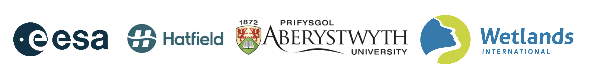
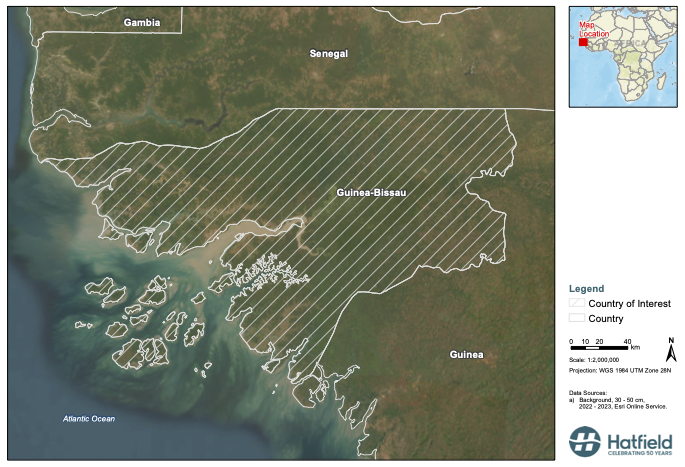
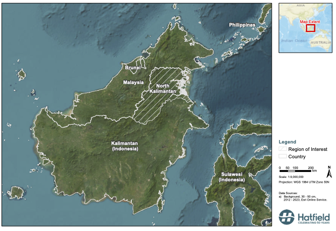

# Radar Alerts for Mangrove Monitoring (RAMM)

- Dr. Andrew Dean - [Hatfield Consultants LLP](https://hatfieldgroup.com)
- [Benjamin Smith](https://github.com/bnjam) - [Hatfield Consultants LLP](https://hatfieldgroup.com)
- [Pete Bunting](https://github.com/petebunting) - [Aberystwyth University](https://www.aber.ac.uk/en/)
- [Dr. Victor Tang](https://github.com/weigangtang) - [Hatfield Consultants LLP](https://hatfieldgroup.com)
- [Lammert Hildarides](https://github.com/lhilarides) - [Wetlands International](https://www.wetlands.org)
- Frank Marking Seifert - [European Space Agency (ESA)](https://www.esa.int)

---

- [Radar Alerts for Mangrove Monitoring (RAMM)](#radar-alerts-for-mangrove-monitoring-ramm)
- [RAMM](#ramm)
  - [Platform](#platform)
  - [Demonstration Areas](#demonstration-areas)
    - [Guinea Bissau](#guinea-bissau)
    - [North Kalimantan, Indonesia](#north-kalimantan-indonesia)
  - [Mangrove Alerting Algorithms](#mangrove-alerting-algorithms)
  - [Platform Architecture](#platform-architecture)

# RAMM

RAMM is a dynamic, event-driven, pipeline that leverages
Sentinel-1 Sythnetic Aperature Radar (SAR) information to
complement the existing and running optical satellite
pipeline by Global Mangfove Watch (GMW).
Optical satellite imagery has been able to provide timely
alerting for mangrove deforestation alerting, however, it
has a drawback when the monitored area is cloud covered.
SAR has the ability to penetrate clouds and detect these
possible missed events.

## Platform

With an Open Call with the European Space Agency (ESA),
funding was provided to develop the RAMM platform on [CREODIAS](https://creodias.eu/).
CREODIAS is a cloud-based platform that provides access to
[Copernicus data](https://creodias.eu/eodata/all-sources/) and processing capabilities.
The platform is built on OpenStack technologies and provides
a development environment for users to interact with the data
and processing capabilities.

## Demonstration Areas

The development of RAMM is focused on two demonstration areas: Guinea Bissau and North Kalimantan, Indonesia.

### Guinea Bissau

~7 to 9% of the country's total land and 86% of the
coastline are covered by mangroves. 
As a byproduct of land conversation for rice 
algriculture and coastal development, mangroves are
experiencing loss and degradation.

Guinea Bissau has been identified by GMW as a hot-spot 
for mangrove change in Africa. 

### North Kalimantan, Indonesia

North Kalimantan is a province in Indonesia that is
located on the island of Borneo.

## Mangrove Alerting Algorithms

To detect mangrove deforestation, RAMM implements a two-stage
approach executed on a recurring basis using Sentinel-1 SAR
data. 
Running the pipeline at the end of each month, the pipeline
iterates through the following stages:

1. **Change Detection**: The first stage is to detect change
   in the SAR data. This is done by gathering the previous
   months acquisitions over the provided target area.
   The acquisitions are stacked and suspect pixels are
   identified using a tuned threshold.
   The suspect pixels are then compared to the same month of the 
   previous year's median composite and classifying as possible
   alerts if the absolute difference is greater than a threshold.
   Outputs are then written to BLOB Storage. 

2. **Mangrove Alert Validation**: The second stage pulls the 
    first stage outputs from BLOB Storage and
    uses a Convolutional Neural Network (CNN) to validate
    that each alert is a mangrove deforestation event.
    The validated alerts are then written to BLOB Storage 
    as a GeoJSON file that can be ingested by the GMW Portal.

The first stage thresholds are tuned by performing a sensitivity
analysis across real-world data.
The second stage CNN is trained with a dataset produced by GMW using
their latest global mangrove extent map and Sentinel-1 data.

## Platform Architecture

The RAMM platform is built on the following technologies:

- [CREODIAS](https://creodias.eu/): The cloud-based platform that provides access to Copernicus data.
- [S3](https://aws.amazon.com/s3/): The object storage service used to store the pipeline outputs.
- [OpenStack](https://www.openstack.org/): The underlying technology offered by CloudFerro for CREODIAS.
- [REST API](https://restfulapi.net/): The API is used to interact with the platform.
- [RabbitMQ](https://www.rabbitmq.com/): The message broker used to manage the pipeline.
- [AMQP](https://www.amqp.org/) is the protocol used by RabbitMQ.
- [Docker](https://www.docker.com/): The containerization technology used to package the pipeline.
- [KEDA](https://keda.sh/): The Kubernetes Event-Driven Autoscaler used to scale the pipeline.

The platform is designed to be scalable and flexible to allow for
the analysis of the entire global mangrove extent.

Developers of the algorithms are provided with a development environment
to interact with the data and processing capabilities of the platform.
They access the platform through a Web UI utilising user authentication. 

The platform is designed to be event-driven, with the pipeline being
triggered by a REST API call that submits a job to populate the
first stage message queue with the required parameters.
At this point, the target area is also distributed into smaller
tiles (MGRS) to allow for parallel processing of the SAR data.
It is this message queue that receives and distributes the
tasks from the first to second stage, ensuring that the pipeline
is scalable, efficient, and concurrent.

&copy; 2025 Hatfield Consultants LLP

